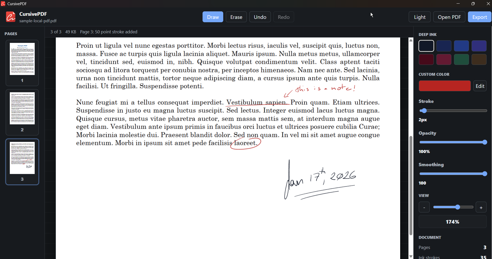

<p align="center">
  
</p>

<h1 align="center">CursivePDF</h1>

<p align="center">
  A cross-platform PDF handwriting app for adding tablet-friendly ink on top of documents.
</p>

<p align="center">
  
</p>

## About

CursivePDF is a desktop app for marking up PDF documents with a dedicated handwriting layer. It is built for pen tablets, styluses, touch screens, and mouse input, with the ink rendered above the original PDF page content.

The app keeps handwriting separate while you work, then writes the ink back into an exported PDF so notes, signatures, corrections, and sketches stay visible above the original document.

## Features

- Open and render PDF documents locally
- Draw with pen, touch, or mouse input
- Keep ink page-specific while moving through a document
- Export an annotated PDF with handwriting placed above original page content
- Preview page thumbnails in the side panel
- Undo, redo, erase strokes, and clear a page's ink
- Choose deep pen-style ink colors
- Set one custom ink color
- Adjust stroke width, opacity, zoom, and pen smoothing
- Toggle light and dark mode
- Save user preferences between sessions

## Status

CursivePDF is currently in early release-candidate development. The core PDF annotation workflow is working, but the app should still be tested carefully before using it for critical documents.

## Built With

- [SvelteKit](https://svelte.dev/docs/kit) and TypeScript for the interface
- [Tauri v2](https://tauri.app/) for the desktop shell
- [PDF.js](https://mozilla.github.io/pdf.js/) for PDF rendering
- [pdf-lib](https://pdf-lib.js.org/) for PDF export

## Development

Install dependencies:

```sh
pnpm install
```

Run the browser development server:

```sh
pnpm dev
```

Run the desktop app in development:

```sh
pnpm tauri dev
```

Check TypeScript and Svelte diagnostics:

```sh
pnpm check
```

Build the frontend:

```sh
pnpm build
```

Build the desktop app and installers:

```sh
pnpm tauri build
```

Windows build outputs are written under:

```text
src-tauri/target/release/
src-tauri/target/release/bundle/
```

## License

MIT
